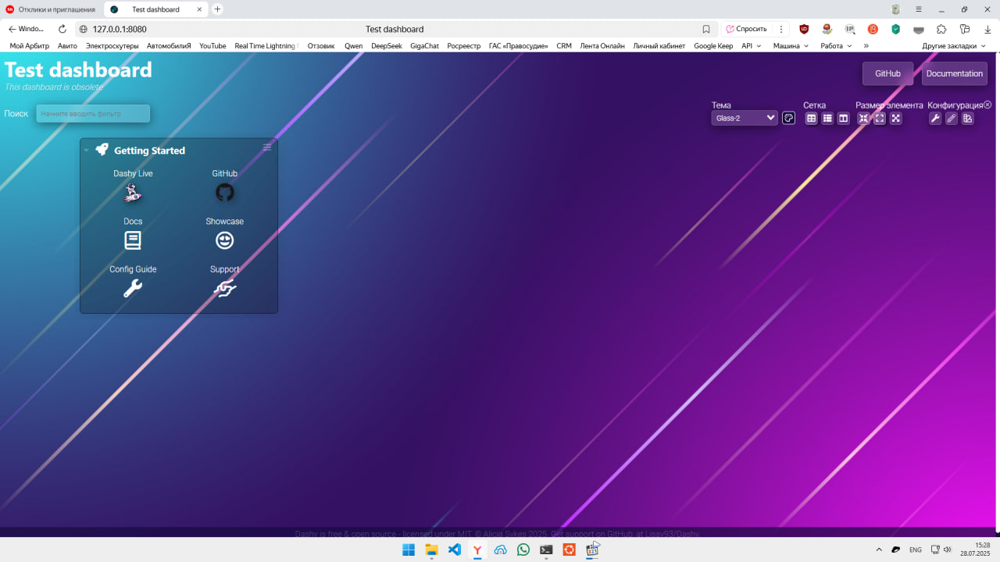

# DevOps Test Task — Dashy on Docker  
**Выполнено для компании "Сибинтек-Софт"**  



Это репозиторий с решением тестового задания на позицию DevOps-инженера.  
Скрипт автоматизирует развёртывание [Dashy](https://github.com/Lissy93/dashy) в Docker с использованием `docker-compose`, включая сборку образа, очистку среды и настройку локального доступа.

---

## 🎯 Задание

### Часть А: Автоматизация развёртывания
Скрипт на bash должен:
1. Проверить работу Docker и доступ в интернет.
2. Создать `Dockerfile` на базе `alpine:3.17`.
3. Собрать образ Dashy из исходников.
4. Сохранить образ в `.tar`-файл.
5. Очистить Docker (контейнеры и образы).
6. Загрузить образ из файла.
7. Создать `docker-compose.yml`.
8. Запустить контейнер на `localhost:8080`.
9. Проверить доступность приложения.

### Часть Б: Настройка и персистентность
- Настроен кастомный дашборд в Dashy.
- Конфигурация дашборда монтируется в контейнер как volume.
- Скрипт гарантирует, что приложение использует локальную конфигурацию.

---

## 🛠️ Как использовать

### Требования
- Linux
- `git`, `docker`, `docker-compose`
- Пользователь в группе `docker` (без `sudo`)

### Запуск
```bash
git clone https://github.com/ваш-ник/sibintek-devops-test.git
cd sibintek-devops-test
chmod +x deploy-dashy.sh
./deploy-dashy.sh
